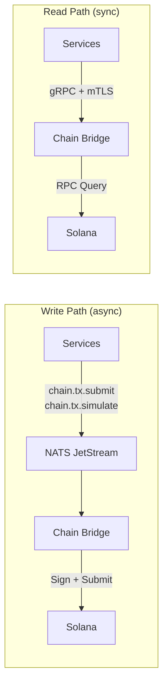

# Chain Bridge (Decentralized Signing Authority)

The **Chain Bridge** is GridTokenX's decentralized signing authority and Solana blockchain interface. All services route blockchain transactions through Chain Bridge — no service directly accesses Solana RPC.

---

## Architecture

Chain Bridge is a lean, security-focused service with flat modules:

```
gridtokenx-chain-bridge/src/
├── main.rs            # Entry point, server wiring
├── api.rs             # gRPC service implementation (read path)
├── vault.rs           # HashiCorp Vault Transit client (key management)
├── nats_consumer.rs   # NATS JetStream consumer (write path)
└── middleware.rs      # SPIFFE identity verification, logging
```

### Two Communication Paths



| Path | Transport | Purpose |
|:---|:---|:---|
| **Write** (submit/simulate) | NATS JetStream (`CHAIN_TX` stream) | At-least-once, durable, replayable transaction submission |
| **Read** (balance/account/slot) | gRPC + mTLS | Synchronous queries with blockhash caching |

---

## Security Model

| Control | Implementation |
|:---|:---|
| **Identity** | SPIFFE SAN URI — not header-based RBAC |
| **Signing keys** | Loaded from Vault Transit at startup (not disk/env var) |
| **Binding** | `127.0.0.1` only (never `0.0.0.0`) |
| **Authorized callers** | `oracle-bridge`, `trading-service`, `iam-service`, `settlement-service` |
| **Log policy** | No debug dump of account keys or instructions to stdout |

---

## Port

| Port | Protocol | Purpose |
|:---|:---|:---|
| `5040` | gRPC (ConnectRPC) | Read path + service API |

---

## Shared Library

Chain Bridge's types and traits are defined in `gridtokenx-blockchain-core`:

| Module | Purpose |
|:---|:---|
| `rpc/transaction.rs` | `ChainBridgeProvider` trait — seam for both read and write paths |
| `rpc/nats_schema.rs` | `TxSubmitMessage`, `TxResultMessage`, `TxSimulateMessage` |
| `rpc/metrics.rs` | `BlockchainMetrics` trait |

---

## Development

```bash
# Build
cd gridtokenx-chain-bridge && cargo build

# Test
cd gridtokenx-chain-bridge && cargo test

# Run (requires Vault + Solana validator)
cd gridtokenx-chain-bridge && cargo run
```

---

## Key Files

| What | Where |
|:---|:---|
| Entry point | [src/main.rs](src/main.rs) |
| gRPC service | [src/api.rs](src/api.rs) |
| Vault Transit client | [src/vault.rs](src/vault.rs) |
| NATS consumer | [src/nats_consumer.rs](src/nats_consumer.rs) |
| Shared blockchain types | [../gridtokenx-blockchain-core/](../gridtokenx-blockchain-core/) |
| Architecture design | [../architecture.md](../architecture.md) (Chain Bridge section) |
